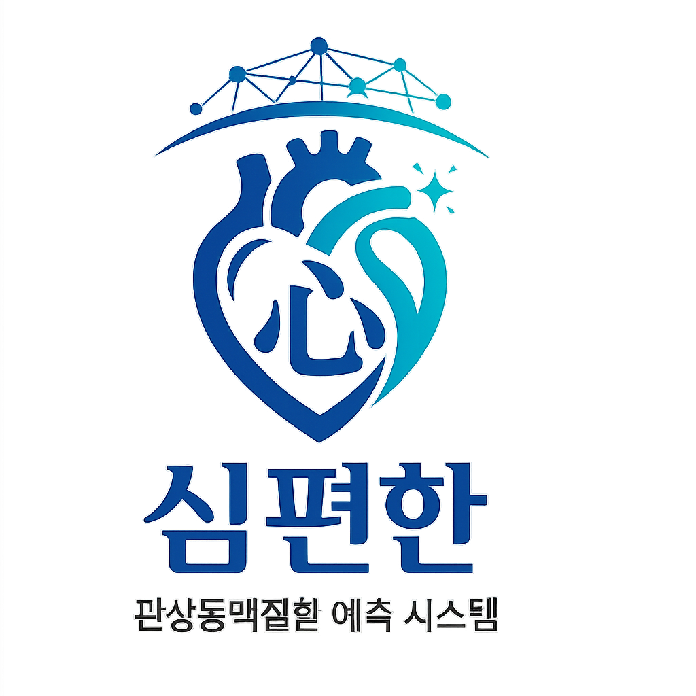

 
  <h1>🫀 심편한: 관상동맥질환(CAD) 및 심혈관조영술(CAG) 위험도 예측 AI 웹 서비스</h1>
  
  <p><b>임상 환자 데이터를 기반으로 관상동맥질환(CAD) 위험도를 예측하고, 의료진과 환자에게 AI 기반의 설명 가능한(XAI) 의사결정 보조 정보를 제공하는 Web Service 프로젝트입니다.</b></p>
  
  <p><i>SimPyeonHan is an AI-driven clinical decision support web service that predicts Coronary Artery Disease (CAD) risk and recommends Coronary Angiography (CAG) based on patient clinical data. It leverages Explainable AI (XAI) using SHAP and diagnostic threshold optimization to assist both healthcare providers and patients.</i></p>

<div align="center">
  

  <p>
    
    
    
    
    
  </p>
</div>

---


## 🎬 프로젝트 시연 및 발표 자료 (Demo & Presentation)

<div align="center">
  <p>이 프로젝트의 실제 구동 영상과 기획/아키텍처에 대한 발표 자료를 아래 링크를 통해 직접 확인하실 수 있습니다.</p>
  
  <br/>

  <table>
    <tr>
      <th align="center">📹 서비스 시연 영상 (Streamlit)</th>
      <th align="center">📊 프로젝트 발표 자료 (PPT)</th>
    </tr>
    <tr>
      <td align="center">
        <a href="https://drive.google.com/file/d/1ZSn1oS0H0DwAgbnLHcEfM240Pgm9-NtC/view?usp=sharing">
          
        </a>
      </td>
      <td align="center">
        <a href="https://github.com/areum-mong/CAD_Prediction_Service/raw/main/cag-upload/docs/CAD_predict_service.pptx">
          
        </a>
      </td>
    </tr>
    <tr>
      <td align="center">
        <a href="https://drive.google.com/file/d/1ZSn1oS0H0DwAgbnLHcEfM240Pgm9-NtC/view?usp=sharing"><b>[시연 영상 재생 및 다운로드]</b></a>
      </td>
      <td align="center">
        <a href="https://github.com/areum-mong/CAD_Prediction_Service/raw/main/cag-upload/docs/CAD_predict_service.pptx"><b>[발표 자료 다운로드]</b></a>
      </td>
    </tr>
  </table>
</div>

---
## 📌 1. 프로젝트 개요 (Project Overview)

본 프로젝트는 환자의 주요 임상 데이터를 분석하여 **관상동맥질환(CAD; Coronary Artery Disease)**의 위험도를 스크리닝하고 **심혈관조영술(CAG; Coronary Angiography)**의 필요성을 추천해 주는 **의료 AI 진단 보조 솔루션**입니다.

의료 데이터 특유의 클래스 불균형 문제를 해결하기 위해 다양한 샘플링 기법을 도입하였으며, 임상적 안전성을 극대화하기 위해 **Youden's Index 기반의 분류 임계값 최적화**를 적용했습니다. 더불어, 블랙박스 모델인 머신러닝의 신뢰성을 확보하고자 **SHAP(SHapley Additive exPlanations)** 분석을 도입하여 **설명 가능한 AI(XAI)** 기반의 직관적인 환자 맞춤형 기여도 분석을 제공합니다.

---

## 📊 2. 사용 데이터셋 (Dataset Information)

* **데이터셋 명:** UCI Machine Learning Repository - **Z-Alizadeh Sani Dataset**
* **데이터 규모:** 303명의 환자 데이터 및 59개의 임상적 속성(Attribute)
* **목표 변수 (Target Column):** `Target` (관상동맥 협착 여부: CAD 환자 vs 정상군)
* **데이터 분석 및 전처리 특징:**
  * 연속형 변수의 이상치 제거 및 결측치 중위수(Median) 대체 파이프라인 구축
  * 나이(`Age_cat`), 수축기 혈압(`BP_cat`), 공복혈당(`FBS_cat`) 변수들에 대해 임상적 진단 기준에 부합하는 **범주화(Categorization)** 수행을 통해 모델 학습의 안정성 증대

---

## 🛠️ 3. 모델 아키텍처 및 이중화 설계 (Dual-Model Strategy)

임상 현장 및 사용자 시나리오에 맞추어 **이중 예측 모델(Dual-Model) 체계**로 설계했습니다.

```
┌─────────────────────────────────────────────────────────────────────────┐
│                          심편한 AI 진단 보조 시스템                     │
└─────────────────────────────────────────────────────────────────────────┘
                                   │
         ┌─────────────────────────┴─────────────────────────┐
         ▼                                                   ▼
┌─────────────────────────────────┐         ┌─────────────────────────────────┐
│     Model 1: 간편 스크리닝 모델  │         │      Model 2: 병원 정밀 진단 모델 │
│   (환자 자가진단 및 빠른 예측)   │         │     (의료진 정밀 진단 및 의사결정)│
├─────────────────────────────────┤         ├─────────────────────────────────┤
│ • 주요 변수 (6개):               │         │ • 주요 변수 (18개):             │
│   나이(Age_cat), 당뇨(DM),      │         │   나이, 당뇨, 고혈압, 흉통유형, │
│   고혈압(HTN), 전형적 흉통,     │         │   호흡곤란, 심잡음, ECG 지표    │
│   비전형적 흉통, 호흡곤란       │         │   (Q Wave, ST 분절 등), TG, ESR │
│                                 │         │   심초음파(RWMA, VHD) 등        │
└─────────────────────────────────┘         └─────────────────────────────────┘
```


---

## 🧠 4. 머신러닝 파이프라인 & 최적화 (ML Pipeline & Optimization)

### 📊 평가 및 비교 모델 모델 리스트
* **분류 알고리즘:** Logistic Regression, Decision Tree, SVM, **XGBoost**
* **불균형 데이터 대응 기법:** 
  * Baseline (기본값)
  * Class Weight Balancing (클래스 가중치 부여)
  * SMOTE (Synthetic Minority Over-sampling Technique)
* **검증 프레임워크:** 데이터 누수를 차단한 **5-Fold Stratified Cross-Validation** 및 Hold-out (80% Train, 20% Test)

### 🏆 최종 모델 선정: XGBoost Classifier (BeforeSMOTE)
엄격한 교차 검증 평가 결과, 모든 평가지표(F1-Score, ROC-AUC, Recall)에서 가장 뛰어난 성능의 일반화 능력을 보인 **XGBoost Classifier**를 Model 1과 Model 2의 최종 엔진으로 고정했습니다.

### 🎯 핵심 임상 최적화 기법: Youden's Index 기반 임계값 탐색
의료 진단 모델에서는 질병이 있는 환자를 정상으로 오진하는 비율(False Negative)을 낮추는 것이 매우 치명적입니다. 따라서 기본 임계값(`0.50`) 대신, **민감도(Sensitivity)와 특이도(Specificity)의 합을 극대화**하는 **Youden's Index 최적 임계값**을 도출하여 서비스에 내장했습니다.
* **Model 1 최적 임계값:** `youden_threshold` 자동 반영
* **Model 2 최적 임계값:** `youden_threshold` 자동 반영

---

## 🔍 5. 설명 가능한 AI (XAI) 구현

블랙박스 모델인 XGBoost의 판단 근거를 실시간으로 시각화하기 위해 **SHAP 파이프라인**을 내장했습니다.

* **글로벌 해석력 (Global Interpretability):** 모델 전체가 어떤 변수를 중요하게 보았는지 나타내는 SHAP Bar 및 Summary(Beeswarm) Plot 제공
* **로컬 해석력 (Local Interpretability):** 특정 환자를 진단할 때, 어떤 임상 요인(예: 당뇨의 유무, 가슴 통증 강도 등)이 위험도 상승/하락에 기여했는지를 나타내는 **Waterfall Plot** 및 **변수별 기여도 테이블**을 실시간 생성하여 설명성을 제공합니다.

---

## 🖥️ 6. Streamlit 웹 애플리케이션 주요 기능

Streamlit을 기반으로 다이나믹하게 동작하는 프리미엄 대시보드를 구성했습니다.
1. **Tab 1: 간편 위험도 (Model 1)**
   * 환자가 직접 입력할 수 있는 직관적인 설문형 UI 제공
   * 예측 결과를 직관적인 0~100% 위험도 프로그레스 바(초록색 ➡️ 노란색 ➡️ 빨간색 그라데이션)로 시각화
   * 당뇨, 고혈압 등 개별 위험요인에 따른 상세 건강 가이드 제공
2. **Tab 2: 정밀 예측 (Model 2)**
   * 심전도(ECG), 혈액검사(TG, ESR), 심초음파(RWMA, VHD) 등 종합 임상 지표 입력 폼 제공
   * **실시간 SHAP 분석 패널**: '예측 실행' 클릭 즉시 **Waterfall Plot** 및 **기여도 수치 테이블**을 실시간 렌더링
3. **Tab 3: 모델 설명**
   * 각 모델의 변수 정의 및 범주화 기준 공유
   * CV 기준 Accuracy, Precision, Recall, F1-Score, ROC-AUC 메트릭을 실시간 지표 카드로 시각화하여 대외 신뢰도 제공

🫀Service Model 1 APP


🫀Service Model 2 APP


---

## 📂 7. 프로젝트 구조 (Directory Structure)

```text
cag-prediction-service-main
├── cag-upload
│   ├── data
│   │   ├── CAD_Data_Preprocessed_Modeling.xlsx  # 전처리 후 최종 모델링용 데이터
│   │   └── Z-Alizadeh sani dataset.xlsx         # 원본 환자 데이터셋
│   ├── docs
│   │   └── CAD_predict_service.pptx             # 프로젝트 발표 및 기획 소개 PPTX 자료
│   └── src
│       ├── CAD_Data_processing.py               # 환자 임상데이터 가공 및 범주화 파이프라인
│       ├── cad_model_training_and_evaluation.py # 4개 알고리즘 모델링, 교차검증, 임계값 도출, SHAP 학습
│       └── CAD_Risk_Prediction_Streamlit_App.py # Streamlit GUI, 다이나믹 위험 바, 실시간 SHAP 시각화
├── .gitignore
└── README.md
```

---

## 🚀 8. 설치 및 실행 방법 (Installation & Run)

### 1) 저장소 복제 (Clone)
```bash
git clone https://github.com/areum-mong/CAD_Prediction_Service.git
cd CAD_Prediction_Service
```

### 2) 필수 라이브러리 설치
프로젝트 실행을 위해 다음 패키지들을 설치합니다.
```bash
pip install pandas scikit-learn streamlit openpyxl xgboost shap matplotlib joblib
```

### 3) Streamlit 웹 애플리케이션 실행
```bash
streamlit run cag-upload/src/CAD_Risk_Prediction_Streamlit_App.py
```


